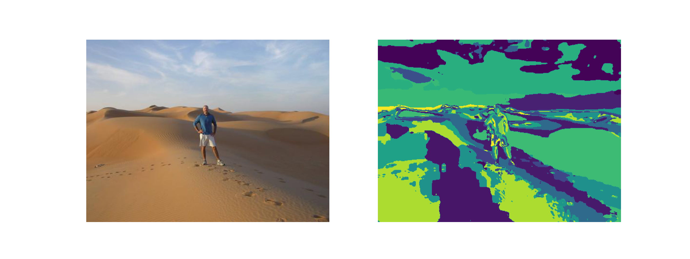
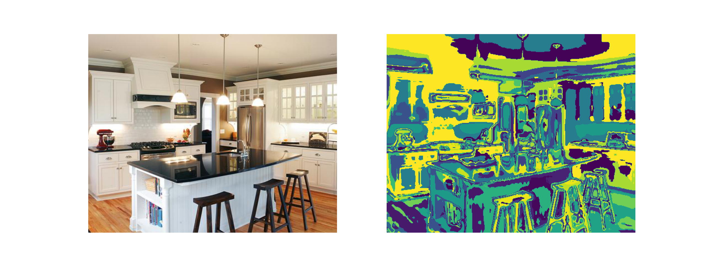

# Scene Classification using Visual Words
This repo is designed to use responses to conventional filters (Gaussian, Laplacian of Gaussian etc.) as a way to represent images. For all images in train-data, we apply K-Means over the features. A visual word is then defined as a centroid of K-Means cluster.

Histogram of words in an image can then be used as an image descriptor. For robustness, a spatial pyramid of histograms is used to define an image.

Repo Structure:
* **visual_filters**: Extracts filter responses based on a pre-defined filter-bank. Centroids of K-Means is defined as a dictionary.

* **spm**: Code for Spatial Pyramid of histogram, used to describe an image.

* **recognition**: Computes a descriptor for each image in train set. Inclues code for Nearest Neighbor, used for inference.

The experiments are performed on a subset of SUN Dataset. 

  
  
  Visualization of the Image(Left) and it's corresponding wordmap (Right)

It is interesting to learn that conventional approach can achieve an accuracy of **~73%** on test data.

_______
#### Notes
Major part of the code was developed as part of 16720 Intro to CV course at Carnegie Mellon University. This repo is under development.

To contact the author, feel free to write to paritosm@andrew.cmu.edu